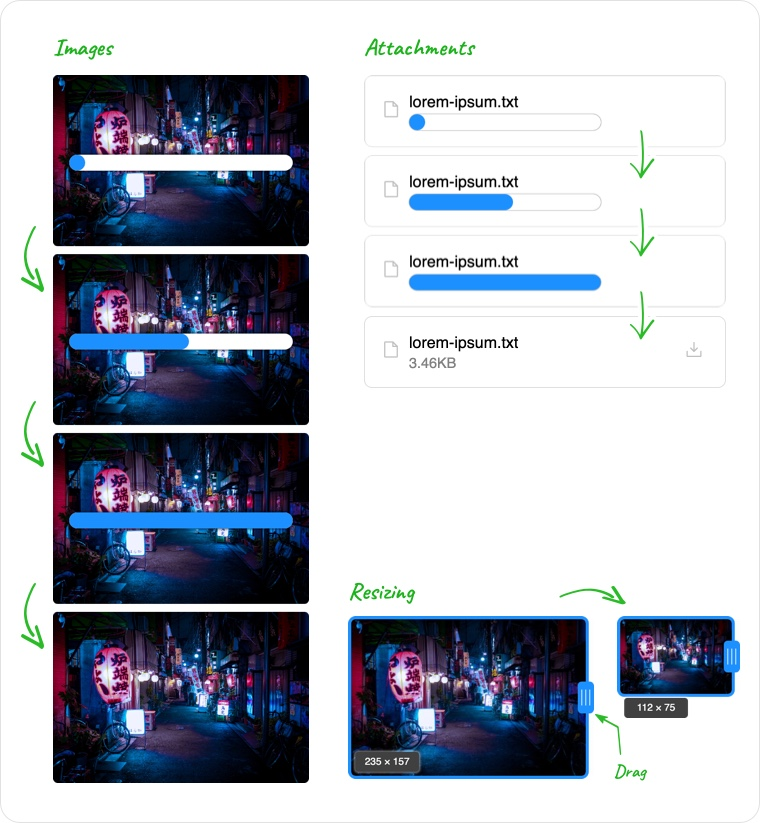

# Slate Portive

`slate-portive` adds beautiful images and attachments to Slate.

Upload files using paste, drag &amp; drop or `<input type="file">` controls.

- Shows upload progress bar
- Drag to resize images
- Images resized on server for faster delivery

This plugin works with [Portive](https://www.portive.com), the hosted back-end for rich text editors. It is a service which hosts files and provides other services for Rich Text Editors. It is the official hosted back-end for these editors:

- [Plate](https://plate.udecode.io/): Rich text editor plugin system for Slate & React
- [Wysimark](https://www.wysimark.com): Rich text editor for Markdown

Start with our [Getting Started Guide](./guides/01-getting-started.md).

### Features

- **Asynchronous Uploads:** While users are uploading an image or file, the user can still make edits in the Editor. A preview image or attachment block is displayed with a progress bar that shows the uload progress. This creates a friendly user experience for users.
- **Multi-File Uploads:** Drag or drop multiple files, paste multiple files or select multiples files to start uploading them in parallel, each with their own progress bar
- **Server Side Image Resizing:** When a user resizes the image in the browser, a resized image is generated on the server. By reducing the size of the image being delivered, images are delivered faster to the browser and reduces bandwidth usage.
- **Show Errors:** If there is an error during upload, the progress bar turns red, says "Upload Failed" and a detailed description of what went wrong is put into the console.
- **High DPI/Retina Images:** Users with a high DPI (dot per inch) device like most smart phones and tablets and some computers, we send a higher resolution image that matches the device.
- \*\*

### Image Features

- Images uploaded to a scalable hosted service built on Amazon Web Services
- Resizes images by dragging a resize bar
- Images are resized on the server for faster downloads and reduced bandwidth
- Uses HTML `srcSet` to deliver higher resolution images to displays with higher DPI (e.g. high resolution images will be delivered at 2x the resolution if possible)
- Shows the width/height while dragging for precise resizing
- While images are uploading, a live progress bar is shown
- The progress bar is not part of Slate's edit history which means undo won't undo progress bar movement
- Uses a CDN for fast performance
- Specify default max width/height for initial view (e.g. you can default to a preview with a width of 320px or go full width)
- Images are just a Slate Element that you define. Just add the `<HostedImage>` component inside it where you want the image to be shown. Because it's just a Slate element you can do all the following:

  - You can choose to display image as block or inline image.
  - You can choose to make it a void blocks (no editable inner content) or support editable content like an editable caption.
  - You have full control over how it displays (e.g. rounded edges, drop shadows, outlines)

- Coming Soon:
  - Image presets. Specify preset sizes for thumbnail, preview and full if you desire
  - Image imports. When a user pastes the URL of an image, it automatically uploads the image to the editor.
  - Sharpening. Enable additional image processing like sharpening for low DPI displays. Sharpening is probably not required for high DPI displays.

### Attachment Features

- Default implementation shows attachment block with filename, file size (friendly format like 12KB) and the progress bar
- Supports progress bar while uploading on custom attachments with a `<ProgressBar>` Component

- Fully customizable to display aspects like size of file, original filename and who uploaded the attachment.

### General Features

- Has an async `save` method that ensures that all the images and attachments have finished uploading with an optional timeout. If the timeout is reached first, will return the document without the completed uploaded.
- Uses a secret API key just for you that gives you control over who can upload, how much and for how long giving you secure control over uploading.

- Coming Soon:
  - Tag file uploads, for example with a userId or a projectId
  - Limit file uploads based on tags and customize message when a limit is exceeded. For example, user `johndoe` can upload up to 1 GB and then he is shown a message and given a link to the upgrade page.
